VS Codeを使った開発チュートリアル
################################################################

0. UbuntuノートPCで開発環境を開く
****************************************************************

ノートPCを開きます。電源が入っていない場合は、電源ボタンを押して起動します。
Ubuntu 24.04のログイン画面に、氏名 ``Demo User`` が表示されます。
ユーザー名 ``demo`` を入力する必要はありません。``Demo User`` を選択し、別途お伝えする
パスワードを入力してEnterを押します。

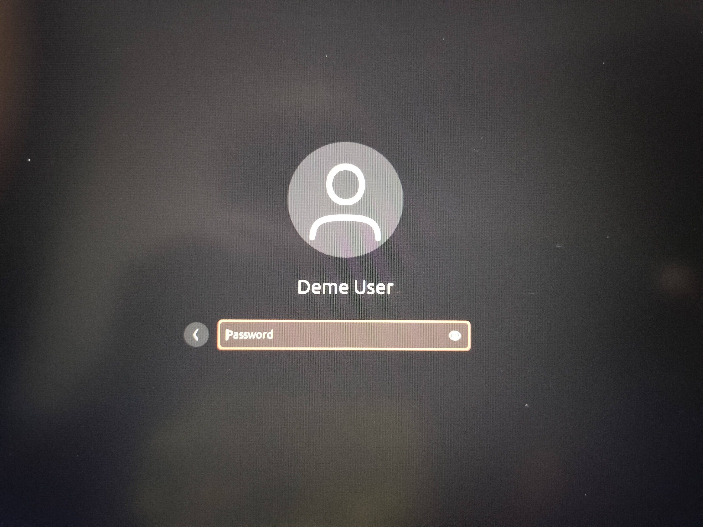

   ``Demo User`` を選択し、別途お伝えするパスワードを入力します。

Ubuntuでアプリや操作を探す
================================================================

ログイン後、画面左下のアプリのマークをクリックすると、使用できるアプリの一覧を表示できます。
画面上部の検索欄へ文字を入力すると、アプリだけでなく、設定や一般的な操作も検索できます。

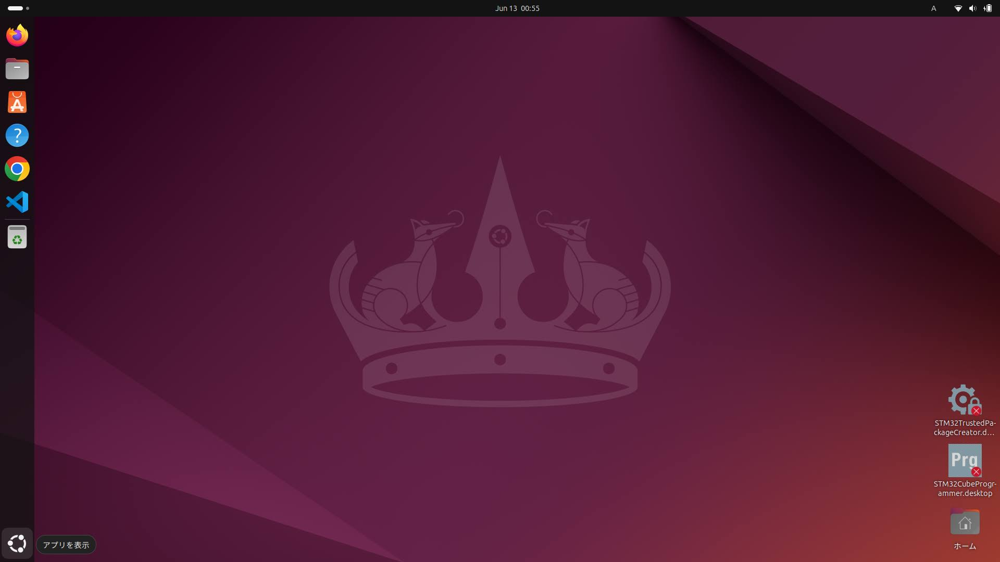

   画面左下のアプリのマークをクリックすると、アプリ一覧と検索欄が表示されます。

例えばノートPCの電源を切る場合は、検索欄へ ``電源オフ`` と入力し、表示された
``電源オフ`` を選択します。その後に確認画面が表示された場合は、もう一度 ``電源オフ`` を選択します。

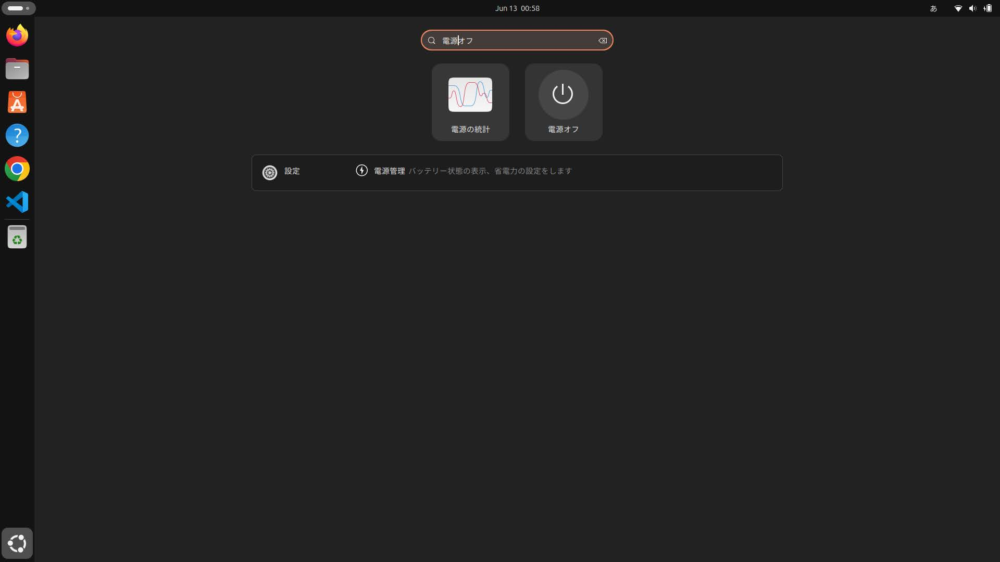

   アプリ一覧の検索欄へ ``電源オフ`` と入力した状態。

VS Codeを開く
================================================================

ログイン後、画面左側のバーにあるVS Codeのアイコンをクリックします。
VS Codeは、前回開いていたこのお試し版の作業フォルダを表示し、開発環境へ自動的に接続しようとします。
接続が完了するまで、数十秒から数分かかる場合があります。接続中はVS Codeを閉じずに待ちます。

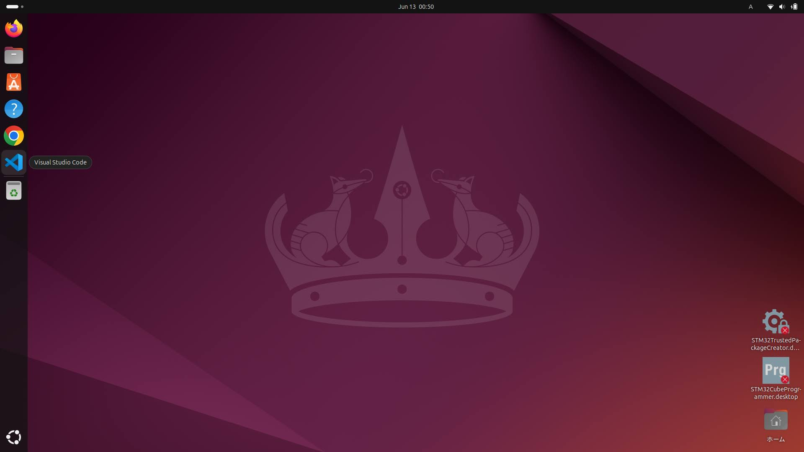

   画面左側のバーに固定されているVS Codeを開きます。

初回起動時や接続中に確認メッセージが表示された場合は、次のように進めます。
英語表示の場合もありますが、基本的には作業フォルダを信頼し、開発環境で開く選択肢を選びます。

.. list-table:: 表示される可能性があるメッセージと選択内容
   :header-rows: 1
   :widths: 45 55

   * - 表示例
     - 選択する内容
   * - ``Do you trust the authors of the files in this folder?``
     - ``Yes, I trust the authors`` を選択します。
   * - ``Reopen in Container`` または ``Open Folder in Container``
     - ``Reopen in Container`` または ``Open Folder in Container`` を選択します。
   * - ``Dev Containers extension is required`` または拡張機能のインストール確認
     - ``Install`` または ``OK`` を選択します。
   * - ``Would you like to install the recommended extensions?``
     - ``Install`` を選択します。
   * - Ubuntuのパスワード入力画面が表示される
     - ログイン時と同じ、別途お伝えするパスワードを入力します。
   * - ``Retry`` または再接続を求めるメッセージ
     - ``Retry`` を選択します。再び表示された場合は、VS Codeを一度閉じて開き直します。
   * - 通知欄に ``Starting Dev Container``、``Opening in Container`` 等が表示される
     - 操作せず、接続が完了するまで待ちます。
   * - VS Codeの更新案内など、開発環境への接続と関係のない通知
     - このチュートリアルでは操作せず、閉じるかそのままにします。

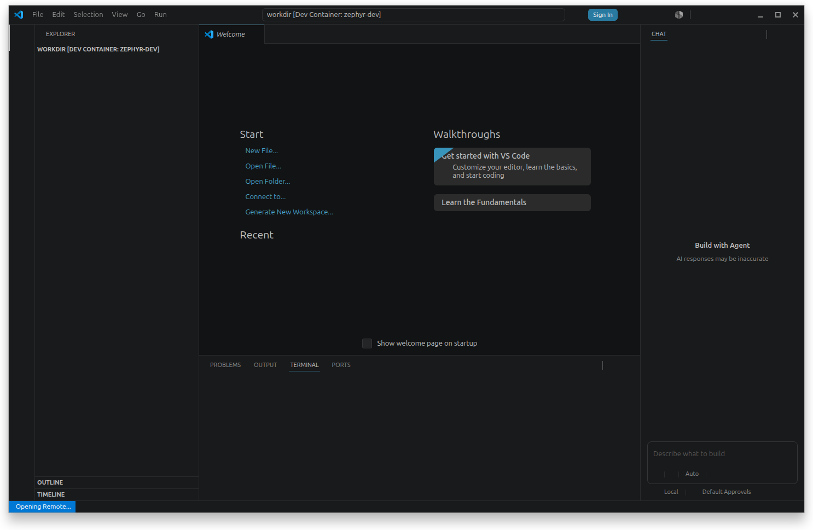

   VS Codeが開発環境へ接続中の画面。確認メッセージが表示された場合は、上表に従って進めます。

接続が完了すると、VS Code画面左下に ``Dev Container`` を含む表示が現れ、
画面左側には ``digital_power_control`` のファイル一覧が表示されます。
以降、この接続先を単に「開発環境」と記載します。

VS Codeでの保存と終了
================================================================

VS Codeでファイルを変更した後は、キーボードの ``Ctrl+S`` を押して保存します。
``Ctrl`` キーを押したまま ``S`` キーを押してください。ファイル名の横に表示されていた丸印が消えれば、
保存できています。

変更したファイルを保存していれば、作業の途中でもVS Code画面右上の ``×`` をクリックして閉じることができます。
次回VS Codeを開くと、このお試し版の作業フォルダと開発環境へ再び自動接続します。
ビルドや基板への書き込みを実行中の場合は、その処理が完了してからVS Codeを閉じます。

目的
****************************************************************

このチュートリアルでは、NUCLEO-H755ZI-Q向けデジタル電源制御環境を使い、
プログラムの内容確認、ビルド（書き込み用プログラムの作成）、基板への書き込み、
動作確認、PWM・ADC設定の変更までを行います。
手順どおりに進めることで、PWM出力、電圧測定、PI制御、Ethernetからの操作を一通り体験できます。

基板内の2つのCPUを役割分担して使用します。一方はEthernet通信を担当し、もう一方は
PWM出力、電圧測定、出力電圧を目標値へ近づける制御を担当します。
通常、お客様が変更するファイルは ``control_core/customer_code`` フォルダ内にあります。

このチュートリアルで使用する接続
****************************************************************

このお試し版では、NUCLEO-H755ZI-Q、付属のRCフィルタ基板、Ethernetケーブル、
ST-LINK USBケーブルを使用します。PWM波形を確認する場合は、オシロスコープも使用します。
ADCの確認では、PWM出力を付属のRCフィルタ基板へ接続します。まず、写真のように、付属のLANケーブル
とマイクロUSBケーブルをPCにつなげます。

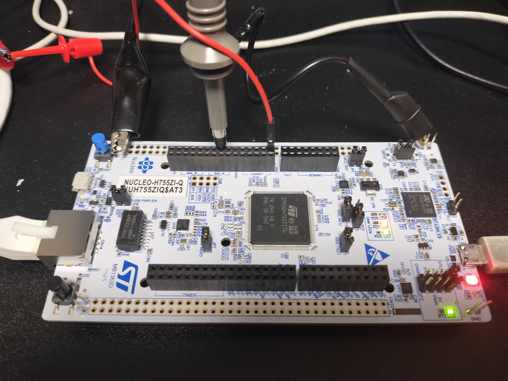

   NUCLEO-H755ZI-Q全体。A0、GND、Ethernet、ST-LINK USB、PE9、PE8の位置を確認します。

1. 作業フォルダを確認する
****************************************************************

VS Codeで開発環境を開いた状態で、メニューから
``Terminal`` -> ``New Terminal`` を選択します。

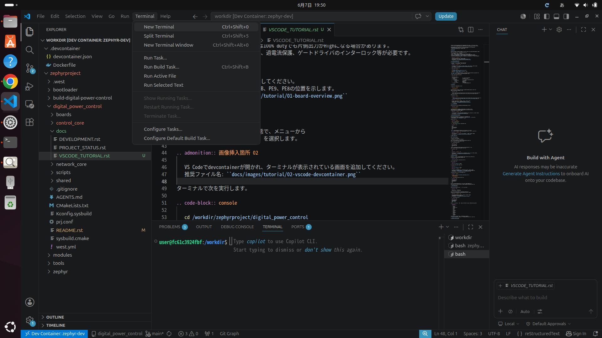

   VS Codeで開発環境を開き、画面下部にコマンド入力欄を表示した状態。

画面下部のコマンド入力欄で、次の1行を入力してEnterを押します。

.. code-block:: console

   cd /workdir/zephyrproject/digital_power_control

チュートリアル開始時の標準設定は、PWM最大周波数が20000 Hz、
ADC電圧表示の最大値が3300 mVです。演習を最初から行う場合は、次の値になっていることを
指導担当者が確認してください。

.. code-block:: c

   #define MAX_FREQUENCY_HZ 20000U
   #define ADC_INPUT_FULL_SCALE_MV 3300U

VS Code画面左側のファイル一覧には、主に次のフォルダがあります。

.. code-block:: text

   digital_power_control/
   |-- control_core/
   |   `-- customer_code/            お客様が変更するファイル
   |       |-- pwm/                  PWM出力の設定
   |       |-- adc/                  測定電圧の換算
   |       `-- feedback/             PI制御の計算
   |-- network_core/                 Ethernet通信
   `-- scripts/                      ビルドと基板書き込み用の命令

2. 初回ビルド
****************************************************************

先ほど ``cd`` で移動した作業フォルダで、次を実行します。

.. code-block:: console

   ./scripts/build.sh

この命令は、以前のビルド結果を消してから、基板内の2つのCPUで動かすプログラムを作成します。
成功すると、書き込み用ファイルが2つ作成されます。

.. code-block:: text

   /workdir/zephyrproject/build-digital-power-control/digital_power_control/zephyr/zephyr.bin
   /workdir/zephyrproject/build-digital-power-control/control_core_m4/zephyr/zephyr.bin

必要に応じて、書き込み用ファイルが作成されたことを次の命令で確認できます。

.. code-block:: console

   ls -lh \
     /workdir/zephyrproject/build-digital-power-control/digital_power_control/zephyr/zephyr.bin \
     /workdir/zephyrproject/build-digital-power-control/control_core_m4/zephyr/zephyr.bin

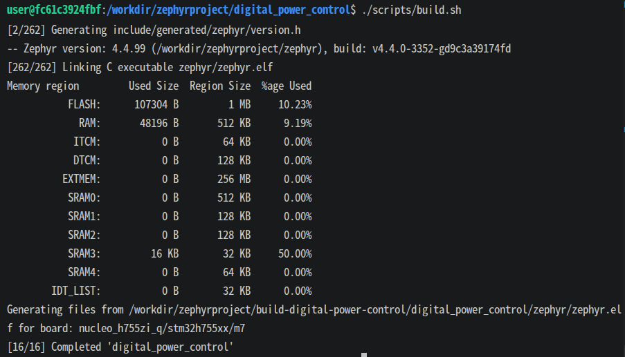

   VS Code画面下部で、2つのプログラム作成が成功した状態。

3. 基板への書き込み
****************************************************************

NUCLEO-H755ZI-QのST-LINK USB端子をPCへ接続し、次を実行します。

.. code-block:: console

   ./scripts/flash.sh

この命令は、直前に作成した2つのプログラムを基板へ書き込みます。
書き込みに失敗する場合は、USB接続とST-LINKの認識状態を確認してください。

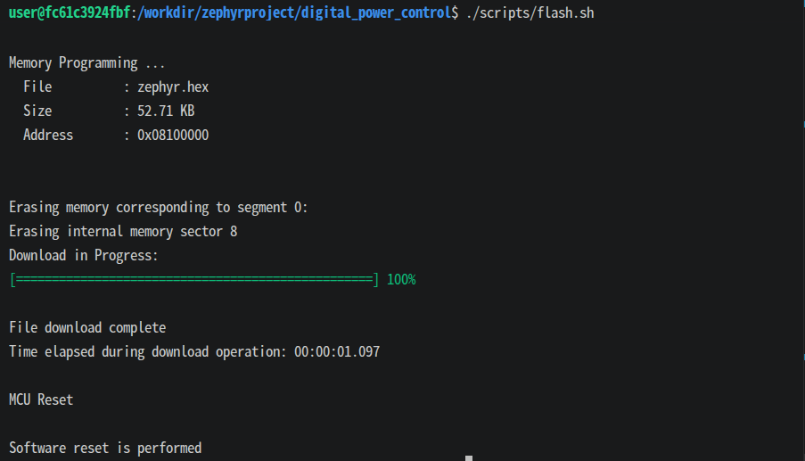

   ``scripts/flash.sh`` による基板への書き込み成功画面。

4. Ethernetで基板を操作する
****************************************************************

PC側のIPアドレスは設定済みです。NucleoのEthernet端子をPCへ接続します。
基板のIPアドレスは ``192.168.100.2`` です。

VS Code画面下部のコマンド入力欄を、ここから2つに分けて使います。

* **プログラム作成・書き込み用**: ``./scripts/build.sh`` や ``./scripts/flash.sh`` を入力します。
* **基板操作用**: 基板へ接続し、PWMを操作する命令を入力します。

VS Codeターミナル右上の ``+`` ボタンを押して、新しいターミナルを開きます。
``nc`` は、PCからEthernet経由で基板へ文字を送るためのプログラムです。
新しいターミナルを基板操作用として使い、次を入力します。

.. code-block:: console

   nc 192.168.100.2 4242

接続に成功すると、次の案内が表示されます。

.. code-block:: text

   NUCLEO-H755ZI-Q complementary PWM server; send HELP

この表示後は、基板操作用の欄が ``nc`` で基板へ接続中です。
この欄へ入力した文字は、PC用の命令として実行されず、Ethernet経由で基板へ送信されます。
入力待ちを示す記号が表示されなくても正常です。次の基板操作命令を1行ずつ入力し、毎回Enterを押します。

.. code-block:: text

   STATUS
   GET
   MODE FEEDFORWARD
   SET 20000 25 0
   GET
   OFF

``SET`` の3つの数値は、順番に「周波数Hz」「出力割合%」「上下のPWMを切り替える間の待ち時間ns」です。
``OFF`` を入力するとPWMを停止します。

基板操作用の欄で ``Ctrl+C`` を押すと基板との接続が終了し、PC用の命令を入力できる状態へ戻ります。
再接続する場合は、同じターミナルで再度 ``nc 192.168.100.2 4242`` を実行します。
ビルドや書き込みは、 ``nc`` 接続中ではないプログラム作成・書き込み用の欄で実行してください。

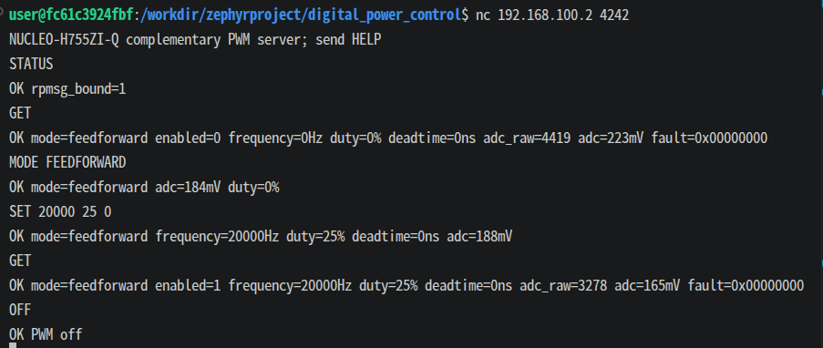

   VS Code画面下部の基板操作用の欄で ``nc`` を実行し、基板へコマンドを送信している状態。

5. PWM波形を確認する
****************************************************************

PWM出力は次のピンです。

* PE9: 主に確認するPWM出力
* PE8: PE9と反対に動作するPWM出力

オシロスコープのGNDをNucleo GNDへ接続し、PE9とPE8を測定します。

基板操作用の欄が ``nc`` で基板へ接続中であることを確認し、次を入力します。

.. code-block:: text

   MODE FEEDFORWARD
   SET 10000 25 500
   GET

期待する波形は、周波数約10 kHz、PE9の出力割合約25%です。
また、PE9とPE8が互いに反対に動作し、切り替え時に約500 nsの待ち時間が入ります。測定後はPWMを停止します。

.. code-block:: text

   OFF

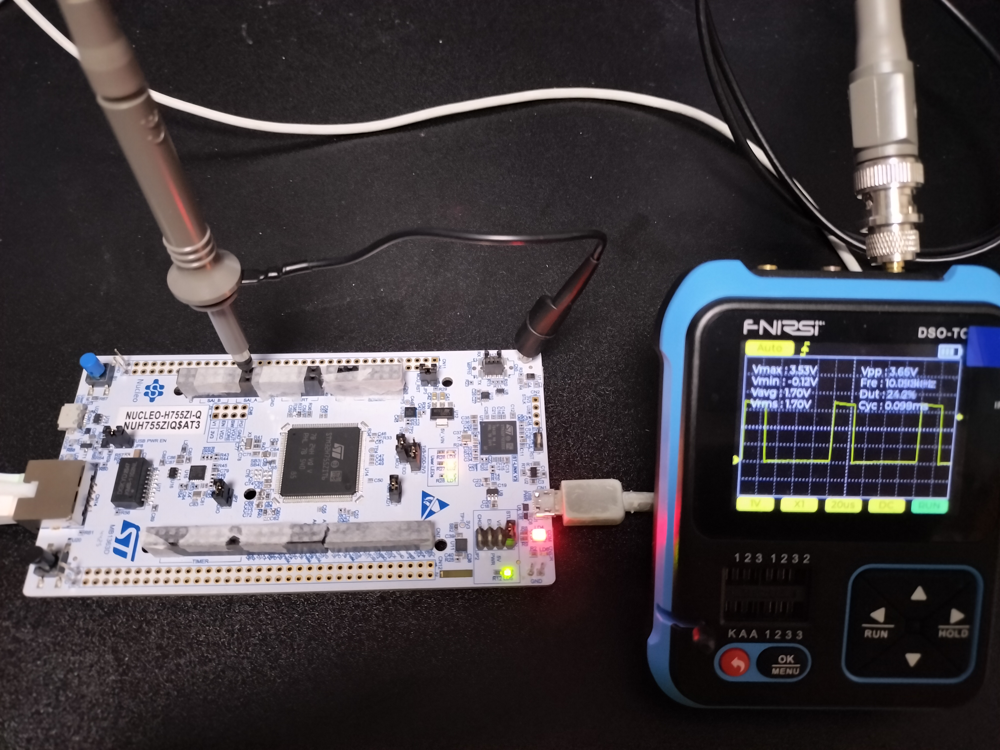

   写真はPE9で測定したPWM波形です。可能であれば、PE8とPE9を同時に測定し、
   2つの出力が同時にHighにならないことと、切り替え時に約500 nsの待ち時間があることを確認してください。
   PE8は写真手前のコネクタCN10にあり、使用する箇所以外はテープで覆っています。
   この確認ができない場合でも、以降の演習は続けられます。想定した波形と異なる場合は、提供元へ連絡してください。

6. PWMコード変更演習
****************************************************************

ここでは、顧客製品で使用できる最大PWM周波数を20 kHzから10 kHzへ制限します。
VS Code画面左側のファイル一覧から、次のファイルを開きます。

.. code-block:: text

   control_core/customer_code/pwm/pwm_control.c

次の定義を探します。

.. code-block:: c

   #define MAX_FREQUENCY_HZ 20000U

これを次のように変更し、 ``Ctrl+S`` を押して保存します。

.. code-block:: c

   #define MAX_FREQUENCY_HZ 10000U

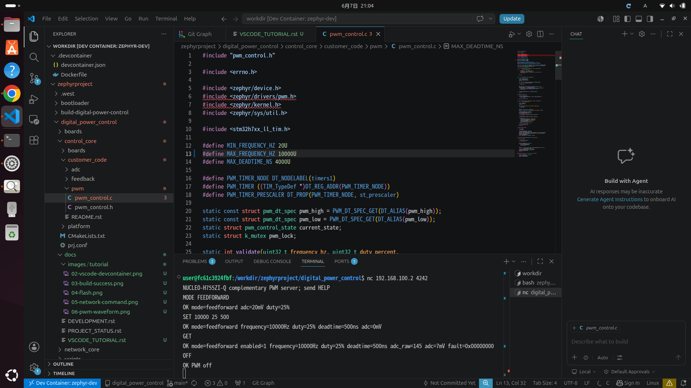

   顧客編集領域の ``MAX_FREQUENCY_HZ`` をVS Codeで変更します。

``Ctrl+S`` でファイルを保存したら、プログラム作成・書き込み用の欄で、再度ビルドと書き込みを行います。

.. code-block:: console

   ./scripts/build.sh
   ./scripts/flash.sh

書き込み後は基板操作用の欄で ``nc 192.168.100.2 4242`` を再実行し、変更結果を確認します。

.. code-block:: text

   MODE FEEDFORWARD
   SET 20000 25 0
   SET 10000 25 0
   GET
   OFF

最初のSET 20000は範囲外としてエラーになり、SET 10000は成功します。
製品仕様で20 kHzが必要な場合は、確認後にMAX_FREQUENCY_HZを20000Uへ戻します。

7. ADCとPI制御の確認
****************************************************************

PWM出力 ``PE9`` を、付属の2段RCフィルタ基板を通してアナログ入力 ``A0`` へ接続します。
RCフィルタは、PWMの細かなON/OFF波形を、測定しやすい平均電圧へ変える回路です。NucleoのGNDも接続します。

.. code-block:: text

   PE9 PWM -- R1 4.7k --+-- R2 4.7k --+-- A0
                        |              |
                       C1 1uF         C2 1uF
                        |              |
   Nucleo GND ----------+--------------+

このフィルタ基板は、抵抗R1、R2が各4.7 kΩ、コンデンサC1、C2が各1 µFです。
写真を参考に、付属のフィルタ基板を接続してください。

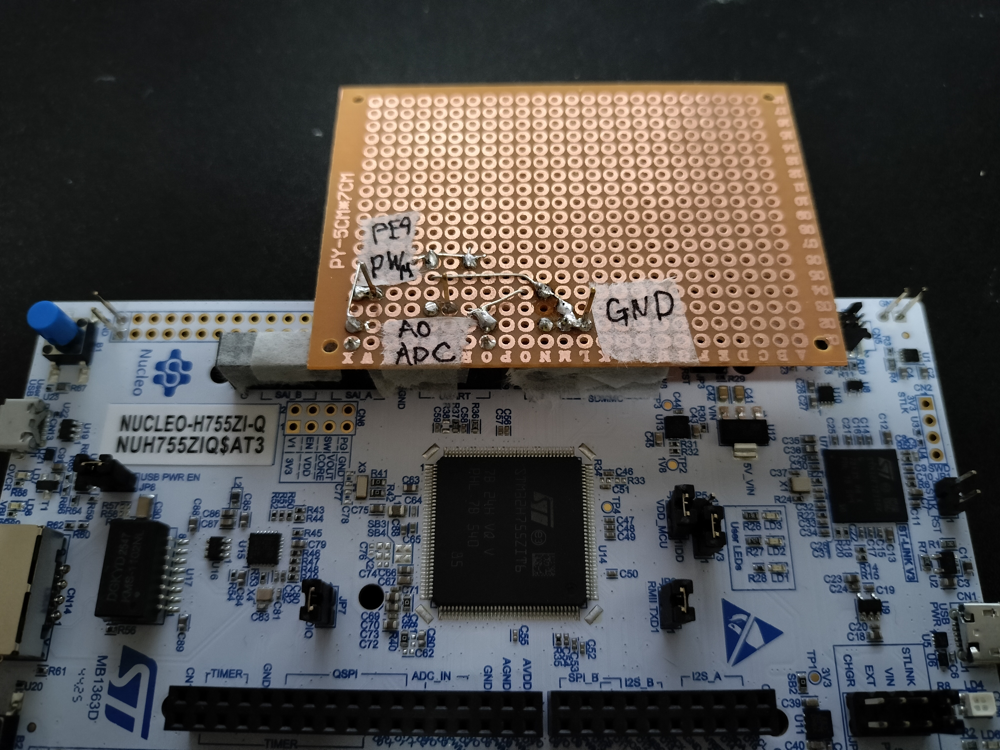

   PWM出力を2段RCフィルタ経由でA0へ戻し、GNDを共通接続します。

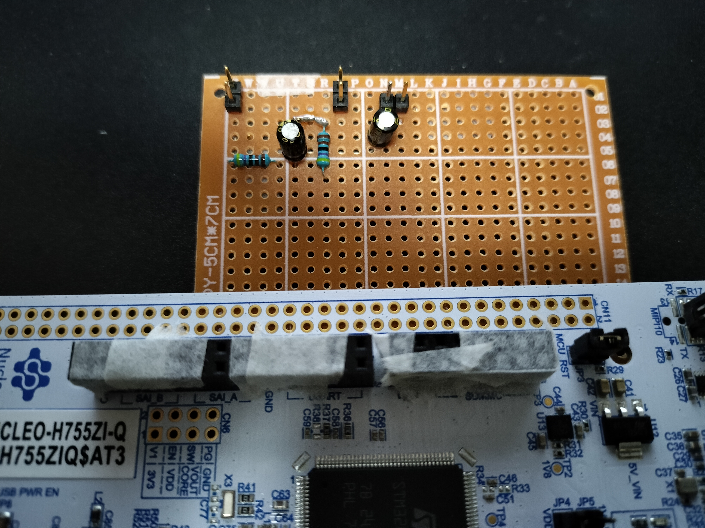

   使用しない差し込み口はテープで覆っています。写真と見比べながら接続してください。

基板操作用の欄が ``nc`` で基板へ接続中であることを確認し、次を入力します。

.. code-block:: text

   MODE FEEDFORWARD
   SET 20000 0 0
   MODE FEEDBACK
   SET 20000 50 0
   GET

``MODE FEEDBACK`` を入力すると、出力電圧を目標値へ近づけるPI制御が有効になります。
この状態では、``SET`` の2番目の数値は出力割合ではなく、測定電圧の目標値です。
``SET 20000 50 0`` の50は、測定範囲3.3 Vの50%、すなわち約1.65 Vを意味します。
``GET`` の ``target=50%`` は目標値、``duty=...%`` はPI制御が決めた実際の出力割合です。

電圧測定とPI制御は、1秒間に10000回実行されます。測定を一定間隔で行うための処理は、
お客様が調整するPI制御のファイルとは分けてあります。通常は
``control_core/customer_code/feedback`` フォルダ内だけを変更してください。

目標値を25%、50%、75%へ変更し、ADC表示がそれぞれ約0.825 V、1.65 V、2.475 Vへ
近づくことを確認します。

8. ADC電圧表示の変更演習
****************************************************************

ここでは、A0の測定結果をmVで表示するときの基準値を変更します。
表示だけが変わり、PI制御の動作は変わりません。

VS Code画面左側のファイル一覧から、次のファイルを開きます。

.. code-block:: text

   control_core/customer_code/adc/adc_input.h

次の定義を探します。

.. code-block:: c

   #define ADC_INPUT_FULL_SCALE_MV 3300U

動作を分かりやすく確認するため、一時的に次へ変更し、 ``Ctrl+S`` を押して保存します。

.. code-block:: c

   #define ADC_INPUT_FULL_SCALE_MV 3000U

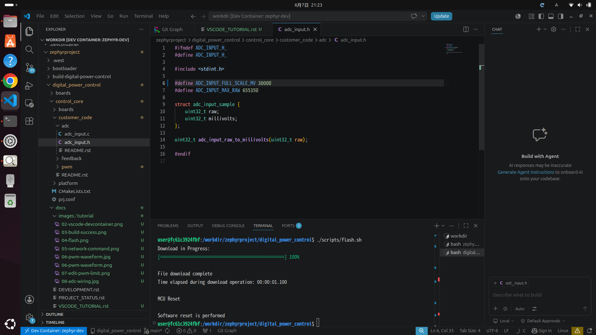

   顧客編集領域の ``ADC_INPUT_FULL_SCALE_MV`` をVS Codeで変更します。

再ビルド、再書き込みします。

.. code-block:: console

   ./scripts/build.sh
   ./scripts/flash.sh

PWM出力をRCフィルタ経由でA0へ接続したまま、FEEDBACKモードで ``GET`` を実行します。

.. code-block:: text

   MODE FEEDFORWARD
   SET 10000 50 0
   MODE FEEDBACK
   GET

目標を50%にした場合、表示上の最大値を3000 mVへ変更したため、``adc`` は約1500 mVと表示されます。
``target=50%`` とPI制御の動作は変わりません。

これは、役割ごとに変更するフォルダを分けているためです。

* ``customer_code/adc`` : 測定値を電圧や電流の表示へ換算する
* ``customer_code/feedback`` : 目標値と測定値からPWMの出力割合を計算する
* ``customer_code/pwm`` : PWMの周波数、出力割合、切り替え時の待ち時間を設定する
* ``control_core/platform`` : 一定間隔の測定や、基板内のCPU間通信を行う。通常は変更しない

確認後は、``ADC_INPUT_FULL_SCALE_MV`` を ``3300U`` へ戻すか、実際に測定した基板の電源電圧に合わせます。
製品では、入力回路による電圧の変化や測定誤差を考慮した換算処理へ変更します。

9. 変更後の最終確認
****************************************************************

製品で使用する設定値へ戻した、または意図した値へ変更した状態で、最終確認を行います。

.. code-block:: console

   ./scripts/build.sh
   ./scripts/flash.sh

書き込み後、基板操作用の欄で ``nc 192.168.100.2 4242`` を再実行します。
接続成功メッセージが表示されたら、次を入力して確認します。

.. code-block:: text

   STATUS
   MODE FEEDFORWARD
   SET 10000 25 500
   GET
   MODE FEEDBACK
   GET
   OFF

確認項目:

* 基板内の2つのCPU用プログラムを両方作成できる
* ``STATUS`` で ``rpmsg_bound=1`` が表示され、基板内の2つのCPUが通信できている
* FEEDFORWARDモードでは ``SET`` で指定した出力割合が使用される
* FEEDBACKモードでは測定電圧が目標値へ近づき、PI制御が出力割合を調整する
* ``OFF`` でPWMが停止する
* ``fault=0x00000000`` と表示され、正常に動作している

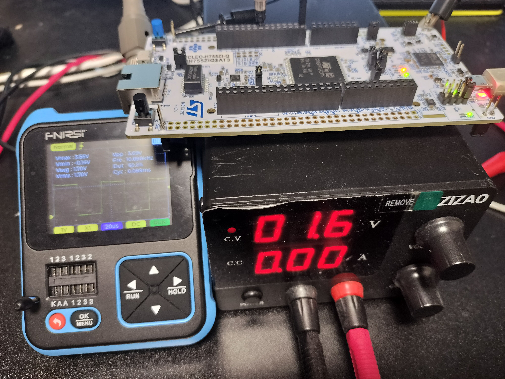

   ADC入力とPWM出力の最終動作確認。

トラブルシューティング
****************************************************************

``MODE FEEDBACK`` が ``ERR cannot set mode (-19)`` になる
================================================================

基板内の電圧測定機能を開始できていません。もう一度ビルドと書き込みを行い、
どちらもエラーなく完了したことを確認してください。

Ethernet経由で基板へ接続できない
================================================================

PC側Ethernet接続のIPアドレスが ``192.168.100.1``、サブネットマスクが
``255.255.255.0`` になっていることを確認してください。
接続できない場合は、Ethernetケーブル、PC側IPアドレス、基板への書き込み結果を順番に確認します。

書き込みできない
================================================================

ST-LINK USBケーブルを挿し直し、他の書き込みソフトを閉じてから、もう一度実行してください。
解決しない場合は、開発環境からST-LINKが使用できる設定になっているか、指導担当者へ確認してください。

次の開発ステップ
****************************************************************

このチュートリアル完了後は、次の順序で製品向け実装へ進むことを推奨します。

#. ``customer_code/adc`` へ製品の電圧・電流換算と校正を実装する
#. ``customer_code/feedback`` のPI制御の強さ、出力割合の制限、保護条件を対象回路に合わせて調整する
#. ``customer_code/pwm`` へ製品固有の周波数、出力割合、切り替え時の待ち時間の制限を実装する
#. オシロスコープで電圧測定周期、制御の遅れ、PWM、切り替え時の待ち時間を検証する
